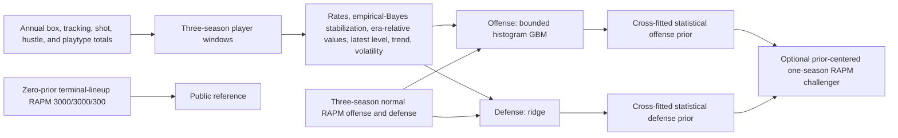

# All-in-One Diagnosis and Feature Blueprint

Date: 2026-08-17

## Bottom line

The current all-in-one is a credible research baseline. It is not a finished
NBA impact system.

- The data-to-target contract is mostly sound and time-purged.
- The offense model has substantial feature engineering and beats the previous
  frozen feature set on a reused 2024 diagnostic.
- The defense model is the main weakness. Its rolling version still relies on
  generic box, rebound, and offensive-role tracking columns.
- The annual defense model is better because its full DFG/rim/hustle block won
  every 2017–24 held-out fold. That improvement has not yet been transferred to
  the rolling AIO in a clean, uninspected test.
- The annual AIO challenger improved future game-margin RMSE on 2022–24, but
  those seasons influenced earlier feature work. Normal zero-prior RAPM stays
  the public reference.
- The next gain should come from better basketball measurements and role
  structure. It should not come from a larger model search.

## Current process

The supervised labels are three-season normal RAPM offense and defense. For a
test window ending in season `Y`, training labels end by `Y-3`. This purge stops
the three-season target windows from overlapping. The sample weight is
`sqrt(min(offensive possessions, defensive possessions))`. Possessions are a
reliability weight, not an input feature.

The frozen rolling models are:

| Side | Model | Input count | 2024 diagnostic RMSE | 2024 correlation |
|---|---:|---:|---:|---:|
| Offense | Histogram gradient boosting | 162 | 0.82701 | 0.62133 |
| Defense | Ridge, alpha 3000 | 50 | 0.89982 | 0.36705 |
| Net | Offense plus defense | 212 component inputs | 1.26244 | 0.57485 |

These are retrodictive player-window metrics. They are not next-season
forecasts. The 2024 comparison is reused diagnostic evidence, not untouched
promotion evidence.

## What is good

1. **The estimand is explicit.** Offense and defense predict the corresponding
   normal RAPM components. Net is their sum.
2. **Target overlap is purged.** A 2024 label does not train on 2022–24 or any
   overlapping three-season target.
3. **Opportunity is separated from skill.** Minutes, games, and possessions do
   not act as general predictive features.
4. **The model ladder is sensible.** Ridge and one bounded tree model are enough
   for the current table size. A neural model is not justified yet.
5. **Offensive engineering is real.** The table includes stabilized shooting
   rates, shot zones, shot context, era-relative levels, recent levels, temporal
   dynamics, Box Creation, Offensive Load, passing ratios, and spacing proxies.
6. **The possession model stays simple.** Normal RAPM remains terminal-lineup,
   zero-prior, and unchanged by this work.

## What is weak

1. **Defense is not measuring enough defense.** The 50 rolling inputs contain
   steals, blocks, rebounds, fouls, recovered blocks, and rebound chances, but
   also many offensive-role features. The selected rolling model has no DFG,
   rim-defense, hustle, matchup, or event-level guarding block.
2. **Shot making and shot difficulty are mixed.** Raw accuracy and shot-quality
   columns exist, but the current rolling table does not explicitly estimate
   actual minus expected points from defender-distance buckets.
3. **Passing volume is stronger than passing quality.** Potential assists and
   assist points exist. Pass value, target value, bad-pass cost, and opportunity
   quality need a clearer contract.
4. **Roles are implicit.** Touch, drive, pull-up, and interior-load columns let a
   tree infer some role. There is no versioned role assignment or role-fit test.
5. **Repeated feature inspection has consumed recent seasons.** More subset
   search on 2022–24 cannot create new evidence.
6. **Current-season confirmation failed.** The frozen 2025 annual SPM missed its
   promotion gate. Its offense remained useful, while defense was weak. This is
   a failure-analysis season, not a new tuning set.

## Current-model interpretation

Run `statistical_interpretability_v1_94d3f2c24b` refit the frozen model on
windows ending by 2021 and measured grouped permutation reliance on the reused
2024 fold. It did not change the model.

| Side | Most important mechanism groups | Mean weighted-RMSE increase when permuted |
|---|---|---:|
| Offense | Shooting, scoring, and spacing | +0.2719 |
| Offense | Public composites | +0.1081 |
| Offense | Rebounding and screening | +0.0106 |
| Defense | Defensive disruption | +0.1167 |
| Defense | Creation, passing, and role | +0.0816 |
| Defense | Rebounding and screening | +0.0793 |

The offense result is coherent. Shooting and the public creation composites
carry most of the fitted signal. The defense result is a warning: offensive
role features are almost as important as defensive activity. They can be valid
proxies for assignment and role, but they are not a satisfactory defensive
measurement system.

Individual permutations are diagnostic only. Correlated columns can make one
feature appear too important when it is permuted alone. The largest individual
offense signals were Behavioral Passer Score, Creation-to-Load, era-relative
true shooting, era-relative points, and latest points. The largest defense
signals were defensive-rebound chances, steals, fouls drawn, recovered blocks,
and average dribbles per touch.

## Public-system audit

Public systems do not disclose enough detail for exact replication. The correct
goal is to reproduce disclosed measurement families with our own explicit
definitions. Do not claim an exact EPM, LEBRON, RPM, RAPTOR, or Net Points clone.

| System | Verified public design ideas | Local implication |
|---|---|---|
| [LEBRON](https://www.bball-index.com/lebron-introduction/) | BoxPIPM prior, stabilized statistics, 12 offensive role archetypes, role-relative expectations, luck-adjusted RAPM | Add explicit skill and role layers. Keep impact separate from talent and fit. |
| [PIPM](https://www.bball-index.com/player-impact-plus-minus/) | Box prior plus luck-adjusted on/off; team context and role interactions | Use as historical design context. Do not add on/off to an independent RAPM prior. |
| [BBall Index Offensive Talent](https://www.bball-index.com/offensive-talent-introduction/) | Shooting, finishing, playmaking, offensive rebounding, screening, and role counterfactuals | Build transparent skill heads and test player value under multiple roles. |
| [BBall Index Passing](https://www.bball-index.com/a-guide-to-passing-stats/) | Creation volume, creation quality, versatility, efficiency, and on-ball gravity | Add pass value and bad-pass cost. Treat potential assists as opportunities. |
| [BBall Index Shooting](https://www.bball-index.com/the-evolution-of-shooting-stats/) | Expected shot result from location, openness, and difficulty; actual minus expected; volume and self-creation | Build shot difficulty and shot-making-above-expected separately. |
| [RAPTOR](https://web.archive.org/web/20191015125623/https:/fivethirtyeight.com/features/introducing-raptor-our-new-metric-for-the-modern-nba/) | Assisted-shot value, rebound type, time of possession, contested threes, shot defense, matchup production, charges, and adjusted on/off | Most families are locally available. Keep the on/off component outside the independent prior. |
| [EPM](https://dunksandthrees.com/about/epm) | Current version is predictive; stat-specific decay, aging and trend models; separate box and tracking SPMs; decayed career RAPM | Use stat-specific stabilization and a separate forecast layer. Do not put age in retrospective impact. |
| [xRAPM](https://xrapm.com/short_desc/xRAPM_explainer.html) | RAPM centered on a statistical prior with box, play-by-play, shot-defense, and deflection data | This matches the research AIO architecture. The zero-prior model remains the control. |
| [Old ESPN RPM](https://www.espn.com/nba/story/_/id/10740818/introducing-real-plus-minus) | Possession-level adjusted plus-minus; later versions used box and tracking information in the prior | Historical comparison only. ESPN changed the formula over time. |
| [BPM 2.0](https://www.basketball-reference.com/about/bpm2.html) | Per-100 box rates, estimated offensive role and position, team efficiency adjustment, interactions, and team residual allocation | Use as a box baseline and source of interactions. Do not copy its team residual into an independent RAPM prior. |
| [MAMBA](https://www.teemohoop.com/mamba/Blog%20Post%20Title%20One-mm8gk-cy9wh) | Assist points created, rim points saved, unassisted makes, charges, playtype POE, team context, and time-decayed RAPM | Rebuild the transparent components. Reject tests that weight future predictions by observed future minutes. |
| [DARKO](https://www.darko.app/about) | Daily predictive player system with stat-specific decay, aging, trends, tracking, and Bayesian/Kalman updating | Relevant to future latent strength, not the retrospective flagship. |
| [ESPN Net Points](https://www.espnanalytics.com/nba-net-pts) | Public output is offensive and defensive point-differential credit, totals, per 100, and WAR | The page does not disclose the full method. Keep conserved possession/WP credit as a separate future estimand. |
| [Six-Factor RAPM](https://databallr.com/six-factor-rapm) | Separate offensive and defensive shooting, turnover, and rebounding components | Use as a factor-RAPM research branch and explanation check. Do not replace direct RAPM labels yet. |

## Feature coverage and new implementation

The repository now has `annual_player_skill_features_v1`. Its validated
artifact is `player_skill_features_v1_cf800d4e7e`.

| Feature | Basketball meaning | Opportunity adjustment | Coverage |
|---|---|---|---|
| Expected shot points per attempt | Shot difficulty from defender-distance and 2/3-point bucket | Leave-one-player-out season/bucket expectation | 2014–24 |
| Era-relative expected shot points | Shot difficulty relative to the season environment | Season-centered leave-one-player-out expectation | 2014–24 |
| Shot-making points above expected per 100 | Actual points minus expected points | 200-attempt empirical-Bayes shrinkage | 2014–24 |
| Tight-shot attempt share | Share of attempts with a tight or very tight defender | 100-attempt shrinkage | 2014–24 |
| Pass-creation points per potential assist | Value created per passing opportunity | 100-opportunity shrinkage | 2014–24 |
| High-value assist share | Share of potential assists classified as high value | 100-opportunity shrinkage | 2014–24 |
| Bad-pass turnovers per 100 passes | Passing error cost | 250-pass shrinkage | 2014–24 |
| Screen-assist points per 100 | Teammate scoring created by screens | 500-possession shrinkage | 2018–24 |
| Deflections per 100 | Disruption | 500-possession shrinkage | 2018–24 |
| Charges per 100 | Forced offensive fouls | 500-possession shrinkage | 2018–24 |
| Defensive boxouts per 100 | Rebound work not captured by rebounds | 500-possession shrinkage | 2018–24 |
| Loose balls recovered per 100 | Possession-recovery activity | 500-possession shrinkage | 2018–24 |

The artifact has 5,791 player-seasons from 2014–24, 1,499 players, unique keys,
and no infinite values. Shooting covers 5,760 rows. Passing covers 5,436 rows.
Hustle covers 3,855 rows because the source begins in 2018. The build excludes
the partial 2025 snapshot by default. QA found a 1.60-IQR 2018-to-2019 shift in
absolute expected shot points. The absolute column stays for audit. The era-
relative version is the model candidate.

Rolling integration `statistical_features_v2_d67bb64ac7` has 6,689 player-
windows and 257 feature columns. Annual integration
`statistical_features_v2_2515b57958` has 5,791 player-seasons and the same 257
feature columns. Both have unique keys, no infinite or bounded-value failures,
and no missing new-feature values after season-neutral imputation.

These are candidate inputs. They have not earned inclusion in the frozen AIO.

## Factor architecture

Keep two distinct paths.

### Direct impact path

Predict offensive and defensive RAPM directly. Group the features and
explanations into eight basketball factors:

1. offensive eFG or shot value;
2. offensive free-throw pressure;
3. offensive turnovers;
4. offensive second chances;
5. defensive eFG or shot suppression;
6. defensive free-throw prevention;
7. defensive forced turnovers;
8. defensive possession finishing.

This remains the primary AIO path. It keeps the target in points per 100 and
allows a nonlinear model to use cross-factor interactions.

### Factor-RAPM research path

Fit separate lineup-adjusted factor outcomes. Then estimate how the factors map
to points. Use it to check explanations and identify which player effects are
stable. Do not force factor components to sum exactly to direct RAPM until a
separate conservation model earns that claim.

Use eFG plus free throws for the eight-head model. Use TS, turnovers, and
offensive rebounding for a six-head ablation. Do not use TS and a separate free-
throw head in the same decomposition because that double counts free throws.

## Aging-safe validation

The user concern is valid for forecast evaluation: raw next-year accuracy can
reward age-shaped proxies. The fix is not to train retrospective impact on age.

Use four diagnostics, but keep only one promotion target per estimand:

| Test | Purpose | Rule |
|---|---|---|
| Same-window held-out RAPM | Retrospective impact fit | Primary for an annual retrospective SPM |
| `T -> T+1` raw | Real forecast performance | Primary for latent-strength forecasts |
| `T -> T+1` aging-residualized | Skill persistence after expected aging | Estimate the aging curve inside earlier training folds only |
| `T -> T-1` reverse diagnostic | Detect features that only encode age direction | Diagnostic only; never call it a deployment forecast |

Also report stable-player, age-band, exposure-band, traded-player, and role-
change subgroups. Compare forward and backward residual correlations. A feature
that only helps raw forward prediction, loses after aging adjustment, and fails
the reverse diagnostic is an age proxy rather than strong skill evidence.

Fit the aging curve on changes in a stable base rating with partial pooling by
age and exposure. Compare a simple spline with a hierarchical curve. Select the
curve on older seasons only. Never use Season 2027 during development.

First diagnostic run `aging_balanced_validation_v1_ec5122d5a3` applies an
earlier-only ridge spline to the frozen annual SPM. It scores four eligible
origin seasons and 1,768 matched player transitions in each direction.

| Direction | Net target | Mean RMSE | Mean correlation |
|---|---|---:|---:|
| Forward | Raw next season | 1.6277 | 0.4095 |
| Forward | Aging adjusted | 1.6380 | 0.4399 |
| Reverse | Raw previous season | 1.5860 | 0.4046 |
| Reverse | Aging adjusted | 1.5660 | 0.3837 |

The raw forward and reverse correlations are similar. This does not support the
claim that the current SPM works mainly because it encodes the direction of
aging. Adjustment improves forward correlation but worsens forward RMSE; the
reverse result moves the other way. Keep the spline as a diagnostic. Do not use
it as a replacement target or add age to the retrospective model.

## Forbidden-feature sensitivity

| Input | Primary retrospective AIO | Sensitivity | Recommendation |
|---|---|---|---|
| Age and experience | Exclude | Yes, forecast layer | Use only for aging and latent-strength forecasts |
| Height and listed position | Exclude | Yes, explicit role interaction | Prefer behavior-derived roles; retain a published-formula challenger when needed |
| Minutes and games | Exclude as predictors | Reliability only | They measure coach deployment and opportunity |
| Possessions and attempts | Exclude as predictors | Reliability only | Use for shrinkage, weights, and coverage |
| On/off and plus-minus | Exclude | Contamination upper bound | They share signal and noise with the RAPM target; do not use in an independent prior |

The existing on/off sensitivity greatly improved fitted validation. That does
not make it suitable. It is expected to look strong because it reuses the same
team-score evidence that RAPM is trying to allocate.

## Role and lineup roadmap

1. Build behavior-only role descriptors from touches, time, drives, pull-ups,
   assisted shots, playtype mix, screens, rolls, cuts, and interior activity.
2. Fit role clusters only inside the chronological training period. Test cluster
   stability and avoid semantic names until the clusters are inspected.
3. Estimate role-relative skill residuals. A high score means that a player is
   better than players doing comparable work, not that the role itself is good.
4. Train a player-role interaction challenger. Predict the same player under
   each feasible role. Label this a counterfactual model, not observed impact.
5. For team and lineup forecasts, combine projected availability, projected
   minutes, player latent strength, role fit, and interaction terms. Publish
   one-, two-, three-, four-, and five-month horizons. Do not use actual future
   lineups or minutes in a pre-period forecast.

## Frozen execution order

1. **Done:** audit the current model and generate out-of-sample grouped
   interpretation.
2. **Done:** build and validate the first 12-field annual skill layer; keep 11
   fields as model candidates.
3. Integrate the feature layer into the annual and rolling feature tables. Use
   2014–21 for development. Treat 2022–25 as already inspected diagnostics.
4. **Done:** build the aging-residualized forward and reverse diagnostic
   harness. The first spline gives mixed evidence and does not replace the raw
   target.
5. **Done:** integrate the validated skill features into annual and rolling
   tables without fitting or selecting a model. Generate coverage and drift QA.
6. Freeze one direct AIO challenger with the eight factor groups. Compare it
   with the current offense GBM plus defense ridge on identical rows.
7. **Done:** build behavior-only roles and pass the frozen stability gates.
   See [`BEHAVIOR_ROLES.md`](BEHAVIOR_ROLES.md). Continuous axes and soft
   affinities are eligible research inputs; hard clusters remain descriptive.
8. Build factor RAPM only as a separate research branch.
9. Build the mobile UI after the rating and interpretation contracts freeze.

No model is promoted in steps 3–7 without new confirmation evidence. Season
2027 remains untouched.
